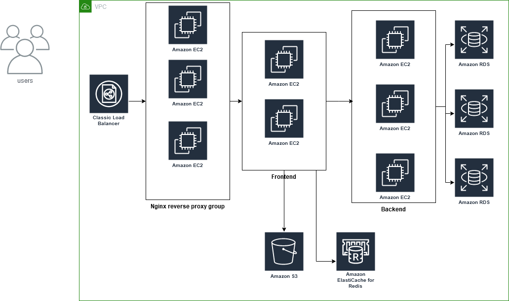
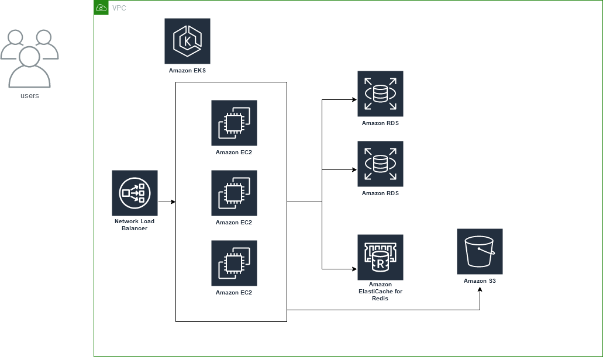

# deploy

## Guides/Tips/misc...etc

* [mattermost/Architecture overview](https://docs.mattermost.com/getting-started/architecture-overview.html)
* [rocket.chat/Deploy with Docker & Docker Compose](https://docs.rocket.chat/deploy/deploy-rocket.chat/deploy-with-docker-and-docker-compose)
* [CNCF/landscape](https://landscape.cncf.io/)
* [free-for.dev](https://github.com/ripienaar/free-for-dev)
* [firecracker](https://github.com/firecracker-microvm/firecracker)
* [bpftrace](https://github.com/iovisor/bpftrace)
* [kubectl-trace](https://github.com/iovisor/kubectl-trace)
* frontend/backend separation
* With VMs

    
* With k8s

    

## serverless

* [deep-dive-serverless](https://aws.amazon.com/tw/getting-started/deep-dive-serverless/)
* [Cloudflare Workers](https://workers.cloudflare.com/)
    * [Workers Status Page](https://workers.cloudflare.com/built-with/projects/status-page)
* [firecracker]    